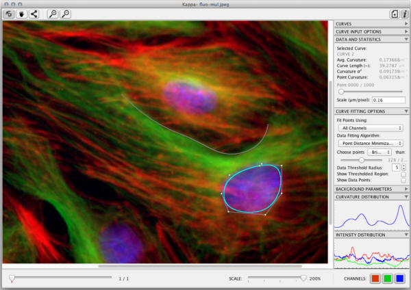

# Kappa

`Kappa` is **A Fiji plugin for Curvature Analysis**.

It allows a user to measure curvature in images in a convenient way. You can trace an initial shape with a B-Spline curve in just a few clicks and then fit that curve to image data with a minimization algorithm. It’s fast and robust.

## Installation

- Download the last released version [here](http://maven.imagej.net/service/local/artifact/maven/redirect?r=releases&g=org.scijava&a=Kappa&v=RELEASE&e=jar).
- Copy the .jar file to your Fiji plugins directory.
- Launch Fiji.
- You can run the plugin with `Plugins ► Analyze ► Kappa - Curvature Analysis`.

## Documentation

See documentation [here](./doc/Kappa_User_Manual.pdf).

**Note**: the documentation has been written for the first version of Kappa. The software has evolved a bit since that time so you might see some features that are not available anymore.

## Authors

`Kappa` has been created originally by [**Kevan Lu**](http://www.kevan.lu/) and converted as a Fiji plugin by [Hadrien Mary](mailto:hadrien.mary@gmail.com).

This work started in 2013 at the [Gary Brouhard laboratory](http://brouhardlab.mcgill.ca/) at the University of McGill.

## License

MIT. See [LICENSE.txt](LICENSE.txt)
