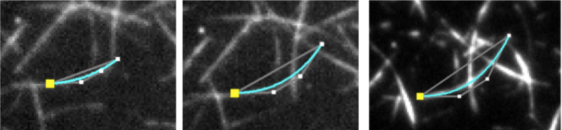

# Kappa Documentation

## Table of Contens

 1. [Introduction](#Introduction)
 1.1 [Source code](#Source code)
 1.2 [Authors](#Authors)
 1.3 [License](#License)
 2. [How to install](#How to install)
 3. [Usage Overview](#Usage Overview)
 3.1 [Step 1: Open an image](#Step 1: Open an image)
 3.2 [Step 2: Define an Initial Curve](#Step 2: Define an Initial Curve)
 3.3 [Step 3: Choose what data you want to fit to](#Step 3: Choose what data you want to fit to)
 3.4 [Step 4: Fit the Curve to the Data](#Step 4: Fit the Curve to the Data)
 4. [Working with Kappa](#Working with Kappa)
 4.1 [Manipulating the Image](#Manipulating the Image)
 4.2 [Entering and Adjusting Curves](#Entering and Adjusting Curves)
 4.3 [Saving and Loading Curves](#Saving and Loading Curves)
 4.4 [Viewing Curve Properties](#Viewing Curve Properties)
 4.5 [Working with Image Stacks](#Working with Image Stacks)
 4.6 [Exporting Data](#Exporting Data)
 4.7[Correlating Brightness with Curvature](#Correlating Brightness with Curvature)

## Introduction

Kappa is a Curvature Analysis Program developed as a Fiji plugin. It allows a user to
measure curvature in images in a convenient way. You can trace an initial shape
with a B-Spline curve in just a few clicks and then fit that curve to image data with
a minimization algorithm. It’s fast and robust.

### Source code

Kappa source code is available at https://github.com/brouhardlab/Kappa.

### Authors

`Kappa` has been created originally by [Kevan Lu](http://www.kevan.lu/) and is now maintained by [Hadrien Mary](mailto:hadrien.mary@gmail.com).

This work started in 2013 in the [Gary Brouhard laboratory](http://brouhardlab.mcgill.ca/) at the University of McGill.

### License

MIT. See [LICENSE.txt](../LICENSE.txt)

## How to install

Kappa is shipped as a Fiji plugin:

- Download and start [Fiji](https://imagej.net/Fiji/Downloads).
- Click on `Help ▶ Update...`.
- In the new window, click on `Manage update sites`.
- Scroll to find **`Kappa`** in the column `Name`. Click on it.
- Click `Close` and then `Apply changes`.
- Restart Fiji.
- Open your image.
- Then you can start the plugin with `Plugins ► Analyze ► Kappa - Curvature Analysis`.

## Usage Overview

Kappa is very easy to use! You can track the curvature of an object on an image in
just a few steps.

### Step 1: Open an image

You can open an image from your hard disk or choose to open the current Fiji image.

### Step 2: Define an Initial Curve

The user can click to define control points that loosely track the shape of an object.
Then, by pressing **ENTER**, the corresponding B-Spline curve will appear.

### Step 3: Choose what data you want to fit to

The user can then adjust the data points that the curve will be fit to. Parameters
such as the colour channel, the brightness threshold, and the distance from the
initial curve can be modified. Any data within these thresholds will be fit.

### Step 4: Fit the Curve to the Data

Kappa will fit the curve to the chosen data points using a least-squares
based minimization algorithm. This reduces the problem of human bias
in the initial curve, and improves the accuracy of the results.

You can then look at the resulting measurements in the sidebar, or
export your data into a CSV file.

## Working with Kappa

### Manipulating the Image

To zoom in or zoom out of the image, the user can simply click the zoom-in or zoom-out buttons or use the mouse wheel.
The user can also use the panning tool to drag the image around.

To adjust the brightness or contrast of the image, go to **`Image → Adjust Brightness/Contrast`**. Kappa uses the Brightness/Contrast panel from ImageJ.

### Entering and Adjusting Curves

#### Entering a Curve

Switch to the **Spline Input Tool**, and click to enter control points. When you are done entering control points, press **ENTER** and a curve will be formed.

You do not have to enter an open B-Spline (with free ends). You can also enter a closed B-Spline, which will close on itself. To do this, just change the setting in the curve input panel.

#### Selecting Curves

Switch to the Selection Tool, and click on a curve to select it. Hold **Shift** and click to select multiple curves. You can also select curves by clicking their name on the list of curves displayed in the side panel.

#### Adjusting Curves

If you want to adjust a curve that you have already entered, select it with the selection tool, and then click and drag on the control points.

### Using the Curve Fitting Tools

Now that you have an initial curve, Kappa has built-in curve fitting tools that let you fit it to a set of data points. Using these tools is straightforward.

#### The Initial Curve

Your initial curve should loosely follow the shape of the data points. An example B-Spline is shown below.

#### Selecting Data Points

Kappa will look near the initial curve for any pixels that are brighter or darker than a threshold. You can adjust this threshold level, as well as how far from the curve you will look, in the sidebar (under **Curve Fitting Options**).

You can also choose to look only on the Red, Green, or Blue Channels, if you have an image with fluorescent labeling.

Clicking **Show Thresholded Region** will let you see the selection range, and clicking **Show Data Points** highlights any included data points in magenta.

#### Fitting the Curve

To fit the initial curve to the data points, go to **`Tools → Fit Curve`**. Alternatively, pressing **F** will do the same thing.

### Saving and Loading Curves

You can save the curves that you have entered into a separate **.kapp** file, which can be opened at a later time.

To save your currently entered curves, go to **`File → Save Curve Data`**. Similarly, to load previously saved curves, go to **`File → Load Curve Data`**.

### Viewing Curve Properties

If a curve is selected, measurements will appear on the sidebar. In addition, a plot of the curve’s curvature distribution, as well as the corresponding pixel intensity distribution, will be displayed.

These measurements are based on a scale factor (in μm/pixel). The default setting is 0.16 μm/pixel, or 160 nm/pixel. You can change this scale factor in the sidebar.

### Working with Image Stacks

If you have a stack of images, you can adjust the shape of a curve on any frame you want. Then, for any intermediate frames, Kappa will automatically translate the control points. This lets you conveniently track changes in shape over an image stack. To change frames, you can drag the frame slider in the bottom left corner.

Above is an example of tracking shape changes across multiple frames. By moving the control points, the curve will adjust as well.

### Exporting Data

The Export Panel lets you export your curve data. The data will be exported as a comma delimited file (.csv), which can then be opened by most other applications.

### Correlating Brightness with Curvature

In many cases, it is highly desirable to know whether a fluorescently-tagged protein preferentially binds to a curved surface. In this situation, it would be useful to correlate the **image intensity** on a specific channel with the curvature. In Kappa, this is very easy to do.

When your data exported, the intensity on each color channel is exported as well. This gives you a measure of the curvature as well as the image intensity, for each point on your curve. To plot the brightness versus the curvature, it is as simple as plotting the two data columns.

